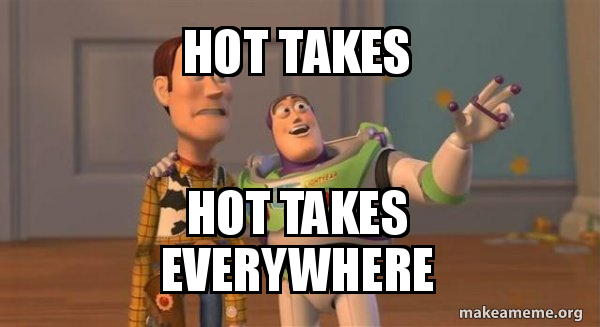

[ds_presentations]: https://the-strategy-unit.github.io/data_science/presentations/YOUR_PRESENTATIONS_FOLDER


## 🏛️ My RAP Pillars

- 🔍 **Visible**: Can I find it?

- ♻️ **Reusable**: Can I make it work for me?

- ✅ **Reliable**: Can I trust it?

## 🔍 Visible

- Public and open 🔓
- Discoverable 
- README 
- LICENSE 📃

## ♻️ (Re)Usable

- 🔓 Open source languages 
- 🧱 Modular code 
- 📦 Easy to install 
- 📖 Documented 

## ✅ Reliable

- 🧪 Tested 
- 👩‍💻 Peer reviewed 
-  Environments 


# {.center}
{fig-alt="Two animated characters from Toy Story, Woody and Buzz Lightyear, stand together. Buzz gestures widely. Text reads 'Hot Takes Hot Takes Everywhere.'"}


## {.center}

::: r-fit-text
 Commented code
:::

::: r-fit-text
 $\neq$ good code
:::

##

::: {.panel-tabset}

### ❌ Over-commented

```r
library(dplyr) # load dplyr package
d1 <- as.data.frame(crimtab) # turn table into dataframe
d2 <- d1 |> # create new dataset
  mutate(# make new variables
    fg = f1(Var1), # convert Var1 into numeric this represents finger length
    ht = f1(Var2),     # convert Var2 into numeric this represents height
    n = Freq # rename frequency column this is the count
  ) |>
  select(fg, ht, n) # keep only required columns

# function to turn factor into numeric 
# this is needed because the variables are factors
# and we want numeric values instead
f1 <- function(x) {
  y <- as.character(x)  # convert factor to character
  as.numeric(y)  # convert character to numeric
}
```

### ✅ Self-documenting

```r
library(dplyr)

criminal_summary <- crimtab |>
  as.data.frame() |>
  mutate(
    finger_length = extract_numeric_from_factor(Var1),
    height = extract_numeric_from_factor(Var2),
    count = Freq
  ) |>
  select(finger_length, height, count)

extract_numeric_from_factor <- function(factor) {
  as.numeric(as.character(factor))
}
```

:::

::: aside
Try _saying_ before naming
:::

## {.center}

::: r-fit-text
**Reusable** ♻️
:::

::: r-fit-text
 not reproducible
:::


## {.center}

::: r-fit-text
Open first 🔓
:::

## {.center}

::: r-fit-text
You [don't need friends](https://statsrhian.github.io/2048/) 👩‍💻
:::
::: r-fit-text
to use Git
:::

::: aside
but it helps
:::


## {.center}

::: r-fit-text
Anyone
:::

::: r-fit-text
 can [build an R package](https://rhian.rbind.io/talks/2026-02-25-rainbowr-pkg/) 📦
:::

## {.center}

::: r-fit-text
 [Ditch the QA Spreadsheets](https://rhian.rbind.io/talks/2026-02-25-rainbowr-pkg/)
:::

## {.center}

::: r-fit-text
It  doesn't have to be perfect
:::

::: r-fit-text
Anything you do to make your code RAP will make it better
:::


## How do I get support? 💙

:::: {.columns}

::: {.column width="60%"}

- RAP drop-in [sign up](https://www.smartsurvey.co.uk/s/XPUHSJ) & [discussions](https://github.com/The-Strategy-Unit/RAP_Drop_In/discussions)
- RAP [Code Review Buddies Network](https://github.com/The-Strategy-Unit/RAP_Drop_In/wiki/Code-Review-Buddies-Network)
- NHS Open Analytics [slack #rap](https://nhsoacommunity.slack.com/signup#/domain-signup)
- Message me @statsRhian 😊

:::

::: {.column width="40%"}

{fig-alt="A cartoon person standing proudly next to a screen"}
:::